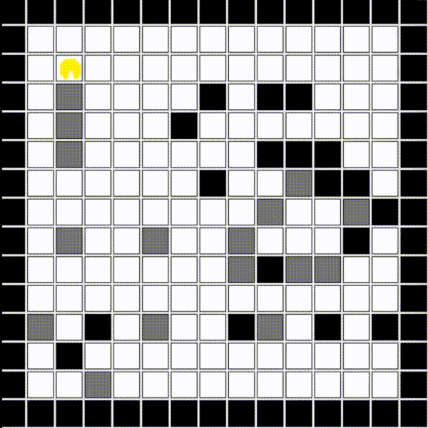
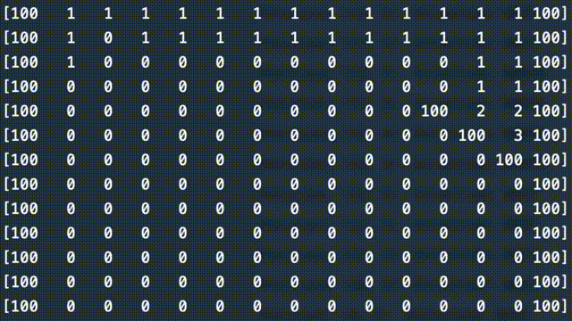
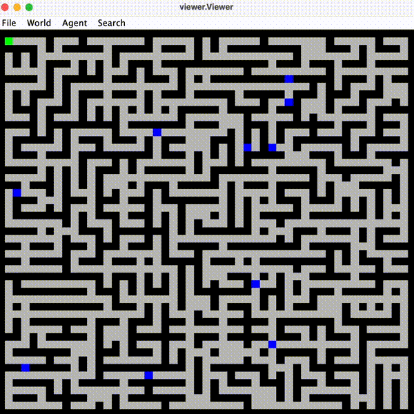
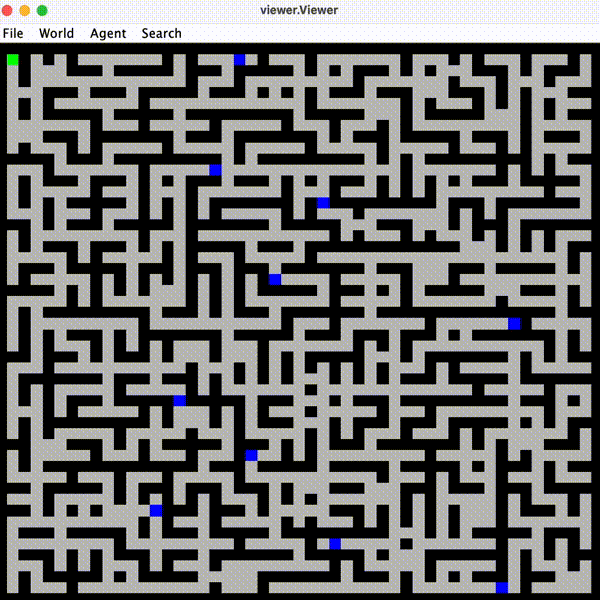
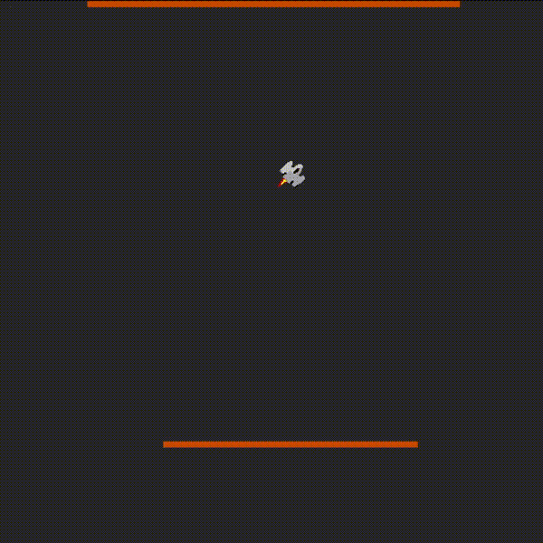

# 🤖 TDDC17 - Artificial Intelligence

This repository contains lab assigments completed during the course TDDC17 - Artificial Intelligence, taught at Linkoping University, Sweden. Attended Fall 2022. Original lab assigments can be found on the course website found [here](https://www.ida.liu.se/~TDDC17/info/labs.en.shtml).

---

### Lab 1 - Robot vacuum cleaner

[Lab 1](https://github.com/jakeberggren/TDDC17-Artificial-Intelligence/tree/main/lab1) has the purpose of introducing the concept of agents in artificial intelligence where the task at hand is to implement a vacuum cleaner robot capable of removing dirt in a rectangular world, handle obstacles, and return to its home position ([x,y] = [1,1]) when finished. This was my personal introduction to Artificial Intelligence which made this assigment very interesting. the [final solution](https://github.com/jakeberggren/TDDC17-Artificial-Intelligence/blob/main/lab1/lab1/myvacuumagent.py) implements a heatmap where the agent bases its choices on how many times it has visited a particular square before. The agent is only able to see the square in front, to the right, and to the left and has no knowledge of the world when it starts. The GIFs below show of the final solution!

 

#

### Lab 2 - Search Algorithms

[Lab 2](https://github.com/jakeberggren/TDDC17-Artificial-Intelligence/tree/main/lab2) implements breadth- and depth first searches in order for a robot vacuum agent to find its way through a maze. The aim of the lab was to understand the strengths and weaknesses of different search algorithms which are often used in Artifical Intelligence applications.

 

#

### Lab 4 - Q-learning Rocket

[Lab 4](https://github.com/jakeberggren/TDDC17-Artificial-Intelligence/tree/main/lab4) introduces reinforcement learning by implementing a Q-learning algorithm which teaches a rocket to hover. The solution uses a classical Q-learning table but the same algorithm is often used together with neural networks to in more advanced AI applications as well. The rocket is able to learn itself to hover in about 200-300k iterations.

 

---
